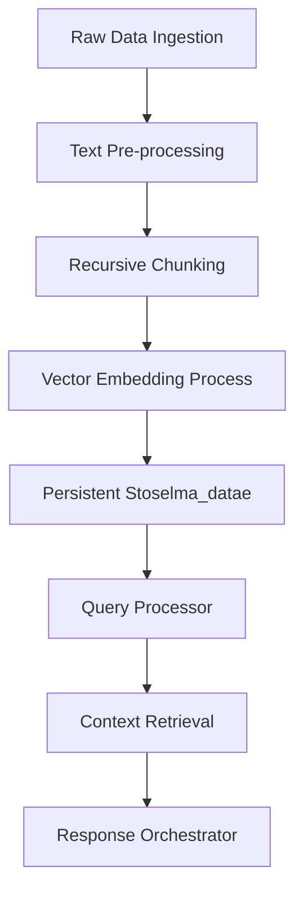
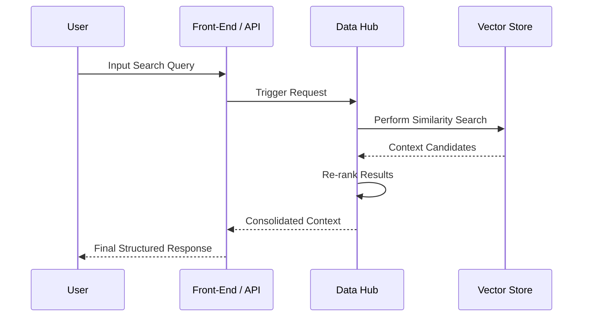

# Selma Search Engine

## Implementation Workflow

## System Architecture

## Core Deployment Pipeline

1. **Environment Setup**: Define metadata and secure access configurations.
2. **Data Integration**: Source material ingestion from diverse formats (PDFs, TXT, JSON).
3. **Indexing Cycle**: Tokenization, embedding generation, and vector persistence.
4. **Service Exposure**: Deploy API endpoints and user interface.
5. **Quality Assurance**: Automated validation of output relevance and throughput metrics.
