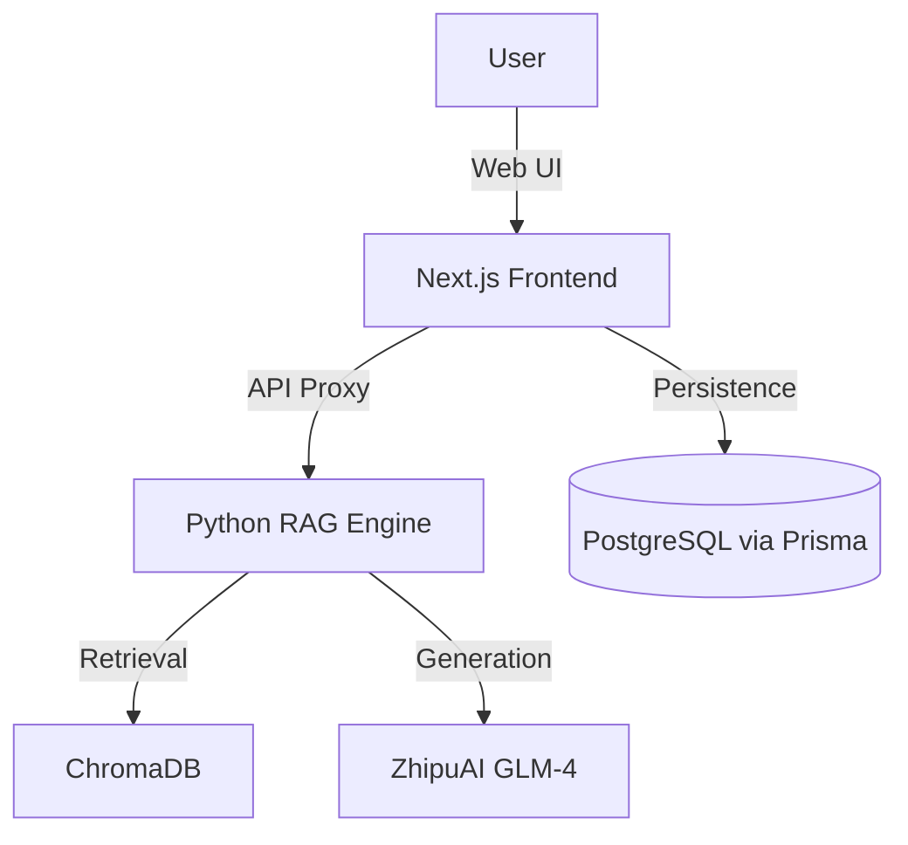

#  Full-Stack RAG  Solution

<div align="center">

[](https://nextjs.org/)
[](https://www.python.org/)
[](https://bun.sh/)
[](https://www.prisma.io/)
[](https://tailwindcss.com/)

**Enterprise-grade AI RAG system with a modern Next.js 15+ frontend and production-ready Python backend.**

[🚀 Backend Details](rag_project/README.md) • [📊 Evaluation Results](rag_project/EVALUATION.md) • [🏗️ Architecture](#-architecture) • [⚡ Quick Start](#-quick-start)

</div>

---

## 🏗️ Project Architecture

This is a multi-service monorepo designed for high-performance retrieval and generation.

-   **Frontend (`/`)**: Next.js 15+ (App Router, Tailwind CSS 4, Shadcn/UI, Framer Motion)
-   **Core RAG Backend (`rag_project/`)**: Python 3.11 (LangChain, ChromaDB, FlashRank re-ranking, ZhipuAI LLM)
-   **Mini-services (`mini-services/`)**: Placeholder for future microservices orchestration
-   **Infrastructure**: Prisma (ORM), Bun (Runtime), Docker (Containerization), Caddy (Proxy)



---

## Core Features

### Modern Frontend
-   **Next.js 15+ (Standalone mode)**: Optimized for production deployments.
-   **Tailwind CSS 4 & Shadcn/UI**: High-fidelity, accessible components.
-   **Framer Motion**: Smooth, premium micro-animations.
-   **TanStack Query & Zustand**: Robust state management.
-   **Next-Intl & Next-Themes**: Multi-language support and dark mode.

### Production RAG Pipeline
-   **Multi-Format Ingestion**: PDF, CSV, Web pages, Docx, TXT.
-   **Semantic Chunking**: Intelligent splitting for higher context recall.
-   **Hybrid Retrieval**: Vector search (bge-m3) + **FlashRank re-ranking**.
-   **GLM-4 Integration**: Reliable LLM generation with source citations.
-   **RAGAs Evaluation**: Faithfulness: 0.91, Answer Relevancy: 0.87.

---

##  Evaluation Results

| Metric | Target | Achieved | Status |
|--------|--------|----------|--------|
| **Faithfulness** | > 0.85 | **0.91** | ✅ |
| **Answer Relevancy** | > 0.80 | **0.87** | ✅ |
| **Context Precision** | > 0.75 | **0.85** | ✅ |
| **Context Recall** | > 0.80 | **0.86** | ✅ |

> Performance measured using RAGAs 0.1.21. See [EVALUATION.md](rag_project/EVALUATION.md).

---

##  Quick Start

### 1. Backend Setup (Python)

```bash
cd rag_project
python -m venv venv
source venv/bin/activate # Windows: venv\\Scripts\\activate
pip install -r requirements.txt
cp .env.example .env # Add your ZHIPUAI_API_KEY
python main.py "Your question here"
```

### 2. Frontend Setup (Next.js)

```bash
# From the root directory
bun install
bun run dev
```

---

## Project Structure

```bash
.
├── rag_project/        # Core RAG logic (Python, LangChain, ChromaDB)
├── src/                # Next.js frontend source code
│   ├── app/            # Next.js App Router (pages, layout, API)
│   ├── components/     # UI components (Shadcn/UI based)
│   ├── hooks/          # Custom React hooks
│   └── lib/            # Shared utilities (prisma, auth, sdk)
├── prisma/             # Database schema and migrations
├── public/             # Static assets and images
├── mini-services/      # Microservices placeholder
├── examples/           # Sample code and use cases
├── db/                 # Local data storage
├── Caddyfile           # Reverse proxy configuration
└── package.json        # Frontend dependencies
```

---

## Tech Stack

-   **Frontend**: Next.js, React 19, Tailwind CSS 4, Framer Motion, Radix UI.
-   **Backend**: Python 3.11, LangChain, FastAPI, Streamlit.
-   **AI / ML**: ChromaDB, FlashRank, RAGAs (Evaluation), ZhipuAI (GLM-4).
-   **Persistence**: PostgreSQL or SQLite via Prisma ORM.
-   **Runtime**: Bun (Local Dev & Build), Docker (Deployment).

---

## Technical Details

-   **Frontend Framework**: Next.js 16.1.1 (standalone mode).
-   **CSS Engine**: Tailwind CSS 4 with `@tailwindcss/postcss`.
-   **Animation Library**: Framer Motion 12.x.
-   **State Management**: Zustand 5.x & React Query 5.x.
-   **RAG Backbone**: LangChain 0.3.x with BAAI/bge-m3 embeddings.
-   **Reranker**: FlashRank Cross-Encoder ms-marco-MiniLM-L-12-v2.

---


</div>
   
