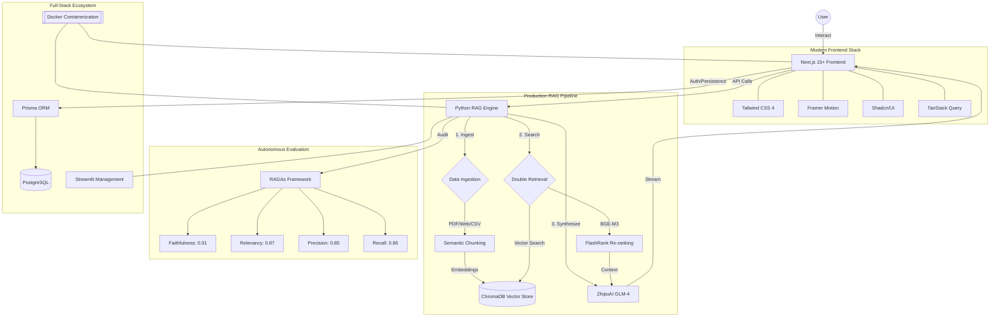

#  Full-Stack RAG  Intelligence System

```mermaid
graph TD
    %% Main Architecture
    User((User)) -->|Interact| WebUI[Next.js 15+ Frontend]
    WebUI -->|API Calls| RAG_Engine[Python RAG Engine]
    
    subgraph Frontend_Stack ["Modern Frontend Stack"]
        WebUI --- Tailwind[Tailwind CSS 4]
        WebUI --- Framer[Framer Motion]
        WebUI --- Shadcn[Shadcn/UI]
        WebUI --- Query[TanStack Query]
    end

    subgraph Core_RAG_Pipeline ["Production RAG Pipeline"]
        RAG_Engine -->|1. Ingest| Ingestion{Data Ingestion}
        Ingestion -->|PDF/Web/CSV| Splitter[Semantic Chunking]
        Splitter -->|Embeddings| Chroma[(ChromaDB Vector Store)]
        
        RAG_Engine -->|2. Search| Retrieval{Double Retrieval}
        Retrieval -->|Vector Search| Chroma
        Retrieval -->|BGE-M3| Rerank[FlashRank Re-ranking]
        
        RAG_Engine -->|3. Synthesize| LLM[ZhipuAI GLM-4]
        Rerank -->|Context| LLM
        LLM -->|Stream| WebUI
    end

    subgraph Quality_Control ["Autonomous Evaluation"]
        RAG_Engine -->|Audit| RAGAs[RAGAs Framework]
        RAGAs --> Faith[Faithfulness: 0.91]
        RAGAs --> Relev[Relevancy: 0.87]
        RAGAs --> Prec[Precision: 0.85]
        RAGAs --> Rec[Recall: 0.86]
    end

    subgraph Infrastructure ["Full-Stack Ecosystem"]
        WebUI -->|Auth/Persistence| Prisma[Prisma ORM]
        Prisma --> DB[(PostgreSQL)]
        RAG_Engine --- Streamlit[Streamlit Management]
        Docker[[Docker Containerization]] --- WebUI
        Docker --- RAG_Engine
    end

```
