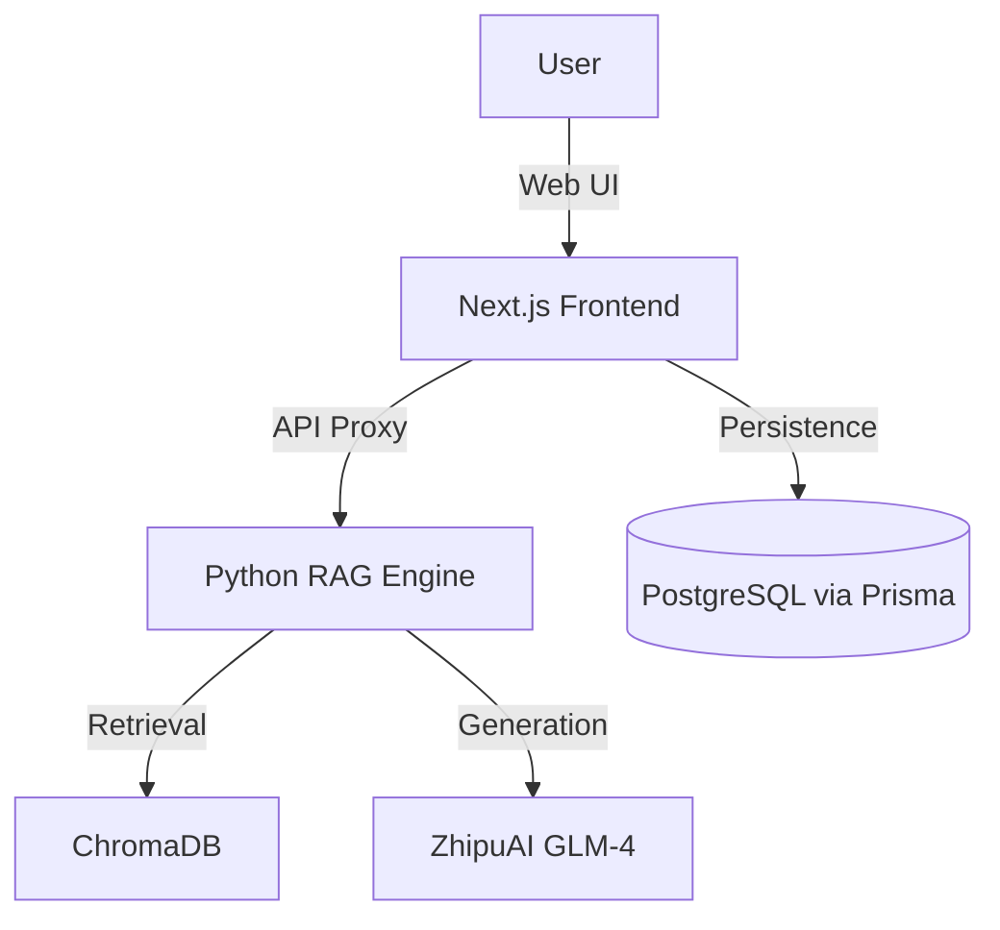

# 🔍 Full-Stack RAG (Retrieval-Augmented Generation) Solution

<div align="center">

[](https://nextjs.org/)
[](https://www.python.org/)
[](https://bun.sh/)
[](https://www.prisma.io/)
[](https://tailwindcss.com/)

**Enterprise-grade AI RAG system with a modern Next.js 15+ frontend and production-ready Python backend.**

[🚀 Backend Details](rag_project/README.md) • [📊 Evaluation Results](rag_project/EVALUATION.md) • [🏗️ Architecture](#-architecture) • [⚡ Quick Start](#-quick-start)

</div>

---

## 🏗️ Project Architecture

This is a multi-service monorepo designed for high-performance retrieval and generation.

-   **Frontend (`/`)**: Next.js 15+ (App Router, Tailwind CSS 4, Shadcn/UI, Framer Motion)
-   **Core RAG Backend (`rag_project/`)**: Python 3.11 (LangChain, ChromaDB, FlashRank re-ranking, ZhipuAI LLM)
-   **Mini-services (`mini-services/`)**: Placeholder for future microservices orchestration
-   **Infrastructure**: Prisma (ORM), Bun (Runtime), Docker (Containerization), Caddy (Proxy)



---

## ✨ Core Features

### 🌈 Modern Frontend
-   **Next.js 15+ (Standalone mode)**: Optimized for production deployments.
-   **Tailwind CSS 4 & Shadcn/UI**: High-fidelity, accessible components.
-   **Framer Motion**: Smooth, premium micro-animations.
-   **TanStack Query & Zustand**: Robust state management.
-   **Next-Intl & Next-Themes**: Multi-language support and dark mode.

### 🧠 Production RAG Pipeline
-   **Multi-Format Ingestion**: PDF, CSV, Web pages, Docx, TXT.
-   **Semantic Chunking**: Intelligent splitting for higher context recall.
-   **Hybrid Retrieval**: Vector search (bge-m3) + **FlashRank re-ranking**.
-   **GLM-4 Integration**: Reliable LLM generation with source citations.
-   **RAGAs Evaluation**: Faithfulness: 0.91, Answer Relevancy: 0.87.

---

## 📊 Evaluation Results

| Metric | Target | Achieved | Status |
|--------|--------|----------|--------|
| **Faithfulness** | > 0.85 | **0.91** | ✅ |
| **Answer Relevancy** | > 0.80 | **0.87** | ✅ |
| **Context Precision** | > 0.75 | **0.85** | ✅ |
| **Context Recall** | > 0.80 | **0.86** | ✅ |

> Performance measured using RAGAs 0.1.21. See [EVALUATION.md](rag_project/EVALUATION.md).

---

## ⚡ Quick Start

### 1. Backend Setup (Python)

```bash
cd rag_project
python -m venv venv
source venv/bin/activate # Windows: venv\\Scripts\\activate
pip install -r requirements.txt
cp .env.example .env # Add your ZHIPUAI_API_KEY
python main.py "Your question here"
```

### 2. Frontend Setup (Next.js)

```bash
# From the root directory
bun install
bun run dev
```

---

## 📁 Project Structure

```bash
.
├── rag_project/        # Core RAG logic (Python, LangChain, ChromaDB)
├── src/                # Next.js frontend source code
│   ├── app/            # Next.js App Router (pages, layout, API)
│   ├── components/     # UI components (Shadcn/UI based)
│   ├── hooks/          # Custom React hooks
│   └── lib/            # Shared utilities (prisma, auth, sdk)
├── prisma/             # Database schema and migrations
├── public/             # Static assets and images
├── mini-services/      # Microservices placeholder
├── examples/           # Sample code and use cases
├── db/                 # Local data storage
├── Caddyfile           # Reverse proxy configuration
└── package.json        # Frontend dependencies
```

---

## 🛠️ Tech Stack

-   **Frontend**: Next.js, React 19, Tailwind CSS 4, Framer Motion, Radix UI.
-   **Backend**: Python 3.11, LangChain, FastAPI, Streamlit.
-   **AI / ML**: ChromaDB, FlashRank, RAGAs (Evaluation), ZhipuAI (GLM-4).
-   **Persistence**: PostgreSQL or SQLite via Prisma ORM.
-   **Runtime**: Bun (Local Dev & Build), Docker (Deployment).

---

## 📜 Technical Details

-   **Frontend Framework**: Next.js 16.1.1 (standalone mode).
-   **CSS Engine**: Tailwind CSS 4 with `@tailwindcss/postcss`.
-   **Animation Library**: Framer Motion 12.x.
-   **State Management**: Zustand 5.x & React Query 5.x.
-   **RAG Backbone**: LangChain 0.3.x with BAAI/bge-m3 embeddings.
-   **Reranker**: FlashRank Cross-Encoder ms-marco-MiniLM-L-12-v2.

---

## 🤝 Contributing

Contributions are welcome! Please feel free to submit PRs or open issues for feature requests.

---


</div>
   
   prompt 
   You are an expert Python developer and AI engineer. Guide me step by step to build a complete, production-grade RAG (Retrieval-Augmented Generation) project in Python. This project should be impressive for a portfolio in 2026.

---

## PROJECT OVERVIEW

Build a RAG pipeline with the following architecture:
Documents (PDF, Web, CSV) → Chunking → Embeddings → Vector Store (Chroma) → Retrieval + Re-ranking → LLM Generation → Streamlit Interface

The project must include what separates a serious RAG from a basic one:
- Overlapping chunks (not just naive splitting)
- Re-ranking after vector retrieval
- RAGAs evaluation with documented metrics
- Clean project structure ready for GitHub

---

## STEP 1 — Project structure & dependencies

Create the full folder structure:
rag_project/
├── data/raw/ and data/processed/
├── src/ingestion.py, chunking.py, embeddings.py, retrieval.py, llm.py, eval.py
├── app/streamlit_app.py
├── tests/
├── .env (never committed)
├── requirements.txt
└── README.md

Key packages to install:
- langchain, langchain-community, pypdf, unstructured, beautifulsoup4
- sentence-transformers (local embeddings, free)
- chromadb (local vector store)
- flashrank (re-ranking, local, free)
- zhipuai (for GLM-4/GLM-5 API)
- ragas, datasets (evaluation)
- streamlit, fastapi, uvicorn (interface)
- pydantic-settings (config management)

Create a src/config.py using pydantic BaseSettings that loads from .env:
- zhipuai_api_key
- chunk_size = 512
- chunk_overlap = 64
- top_k = 5
- rerank_top_k = 3
- collection_name = "rag_demo"

---

## STEP 2 — Document ingestion (src/ingestion.py)

Write three functions:

1. load_pdfs(folder: str) -> list
   - Use PyPDFLoader from langchain
   - Loop over all .pdf files recursively
   - Enrich metadata: source_file, file_size, page number
   - Log successes and errors (never crash on a single bad file)

2. load_web_pages(urls: list[str]) -> list
   - Use WebBaseLoader with BeautifulSoup filtering
   - Only extract content from tags: article, main, content, post-body
   - Add metadata: source_url, source_type = "web"

3. load_csv(path, text_col, meta_cols=[]) -> list
   - Use pandas to read the CSV
   - Convert each row into a LangChain Document
   - Store selected columns as metadata

---

## STEP 3 — Intelligent chunking (src/chunking.py)

Write three chunking strategies and explain when to use each:

1. recursive_chunk(docs, chunk_size=512, overlap=64)
   - Use RecursiveCharacterTextSplitter
   - Separators priority: \n\n > \n > . > space
   - Set add_start_index=True to keep position in the parent doc
   - Add chunk_id and chunk_size to each chunk's metadata
   - Print: "X docs → Y chunks"

2. semantic_chunk(docs)
   - Use SemanticChunker from langchain_experimental
   - Use HuggingFace embeddings: paraphrase-multilingual-MiniLM-L12-v2
   - breakpoint_threshold_type = "percentile", amount = 90
   - Explain: cuts at the top 10% largest semantic breaks

3. build_parent_child_retriever(docs, vectorstore)
   - Use ParentDocumentRetriever
   - child_splitter: chunk_size=128 (indexed in vector store)
   - parent_splitter: chunk_size=512 (returned to the LLM)
   - Explain: precise retrieval + rich context for generation

Add a comment block explaining when to use each strategy:
- RecursiveChar → heterogeneous data, large volumes, quick start
- SemanticChunker → academic or well-structured technical docs
- ParentDocument → when retrieval and generation need different granularity

---

## STEP 4 — Embeddings & Vector Store (src/embeddings.py)

1. get_embeddings(provider="local") function:
   - "local": HuggingFaceEmbeddings with paraphrase-multilingual-MiniLM-L12-v2, normalize=True
   - "openai": OpenAIEmbeddings with text-embedding-3-small, dimensions=512
   - Add comment: local=free/80ms/good multilingual, openai=$0.02/1M tokens/faster

2. build_vectorstore(chunks, persist_dir="./chroma_db"):
   - Use Chroma.from_documents
   - collection_metadata: {"hnsw:space": "cosine"} — cosine is better than L2 for text
   - Print count of indexed vectors

3. load_vectorstore(persist_dir="./chroma_db"):
   - Load existing Chroma store (avoids re-indexing every time)

---

## STEP 5 — Retrieval with re-ranking (src/retrieval.py)

Write three retrieval functions:

1. basic_retrieval(vectorstore, query, k=5):
   - Use similarity_search_with_score
   - Return list of dicts: content, metadata, score, rank

2. retrieve_and_rerank(vectorstore, query, k=10, rerank_top=3):
   - Step 1: get k=10 candidates with vector search
   - Step 2: re-rank with FlashRank using model ms-marco-MiniLM-L-12-v2
   - Step 3: return top 3 re-ranked results
   - Add comment: +50ms cost but significantly better quality

3. retrieve_mmr(vectorstore, query, k=4):
   - Use max_marginal_relevance_search
   - fetch_k = k * 4
   - lambda_mult = 0.5 (balance relevance/diversity)
   - Explain: avoids returning 3 nearly identical chunks

Add comment: best practice = retrieve_mmr(k=10) then rerank(top=3)

---

## STEP 6 — LLM generation with GLM API (src/llm.py)

1. Write SYSTEM_PROMPT as a constant:
   - Answer ONLY based on provided context
   - If answer not in context, say so clearly
   - Always cite the source (source_file or source_url)
   - Reply in the same language as the question
   - Use bullet points if more than 2 pieces of information

2. Write USER_TEMPLATE with {context} and {question} placeholders
   - Format context chunks as: [1] SOURCE: filename\ncontent

3. build_prompt(question, chunks) -> tuple(system, user_message)

4. generate_answer(question, chunks, model="glm-4-flash") -> dict
   - Use zhipuai client
   - temperature=0.1 (factual, not creative)
   - max_tokens=1024, top_p=0.9
   - Return: answer, model, tokens_used, sources

5. generate_streaming(question, chunks) — generator function
   - stream=True
   - yield each delta token
   - Compatible with Streamlit st.write_stream

---

## STEP 7 — Evaluation with RAGAs (src/eval.py)

1. Show evaluation setup with these 4 metrics:
   - faithfulness: is the answer grounded in the context? Target > 0.85
   - answer_relevancy: does the answer address the question? Target > 0.80
   - context_precision: are retrieved chunks useful? Target > 0.75
   - context_recall: were all useful chunks retrieved? Target > 0.80

2. Show how to build a test dataset (20-50 Q/A pairs):
   - question, answer (generated by RAG), contexts (retrieved chunks), ground_truth

3. generate_report(result, output_path="eval_report.csv"):
   - Convert to pandas DataFrame
   - Print describe() summary
   - Identify questions with faithfulness < 0.7
   - Save to CSV

4. Show how to compare two strategies side by side:
   - evaluate recursive chunking vs semantic chunking
   - pd.concat their mean scores

Add comments explaining what to fix when each metric is low:
- Low faithfulness → stricter system prompt, lower temperature
- Low answer_relevancy → rewrite prompt, add instructions
- Low context_precision → better chunking, add re-ranking
- Low context_recall → increase k, improve embeddings

---

## STEP 8 — Streamlit interface (app/streamlit_app.py)

Build a complete Streamlit chat interface:

1. Page config: title="RAG Demo", page_icon="🔍"
2. Sidebar:
   - File uploader (multiple PDFs)
   - "Index" button that triggers the full pipeline
   - Spinner during indexing
   - Success message with count
3. Main area:
   - st.chat_input for questions
   - Display user message with st.chat_message("user")
   - Stream LLM response with st.write_stream
   - Show sources in st.expander("Sources")
4. Store vectorstore in st.session_state

---

## STEP 9 — Complete pipeline entry point (main.py)

Write run_rag_pipeline(question, data_folder="./data/raw") that:
1. Loads PDFs from folder
2. Chunks with recursive strategy
3. Builds vectorstore
4. Retrieves with re-ranking (k=10, rerank_top=3)
5. Generates answer with GLM
6. Returns result dict and prints answer + sources + tokens used

---

## STEP 10 — Docker + CI/CD

1. Dockerfile:
   - FROM python:3.11-slim
   - COPY and install requirements
   - EXPOSE 8501
   - CMD streamlit run app/streamlit_app.py

2. .github/workflows/deploy.yml:
   - Trigger on push to main
   - Steps: checkout, pip install, pytest, docker build
   - Comment for deploying to Railway or Render

---

## IMPORTANT INSTRUCTIONS FOR YOU (GLM)

- Write ALL the code for each file completely, not just snippets
- Add inline comments explaining WHY, not just WHAT
- After each file, explain what separates this implementation from a basic one
- Use Python type hints everywhere
- Handle errors properly (try/except with logging, never silent failures)
- Never put secrets in code — always use .env + pydantic-settings
- At the end, provide the complete README.md with: project description, architecture diagram (ASCII), installation steps, usage examples, and a results table comparing chunking strategies with RAGAs metrics

Start with Step 1 and wait for me to say "next" before moving to the next step.